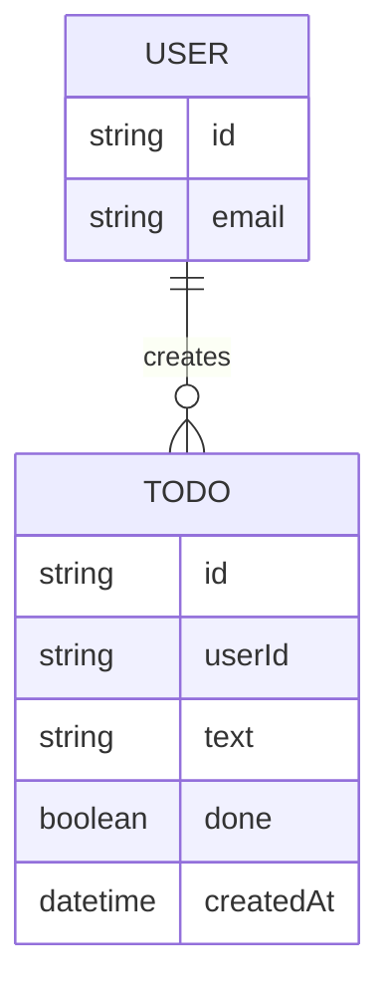

# Domain Model

Two entities: the signed-in User (identity held by Thunder) and the Todo items each user owns.

`USER` is not stored by this project — it is the caller's identity, resolved from the signed-in session. `TODO` is the only entity `todo-api` persists; every row carries the owning user's id and is only ever read or changed through the caller's own identity.