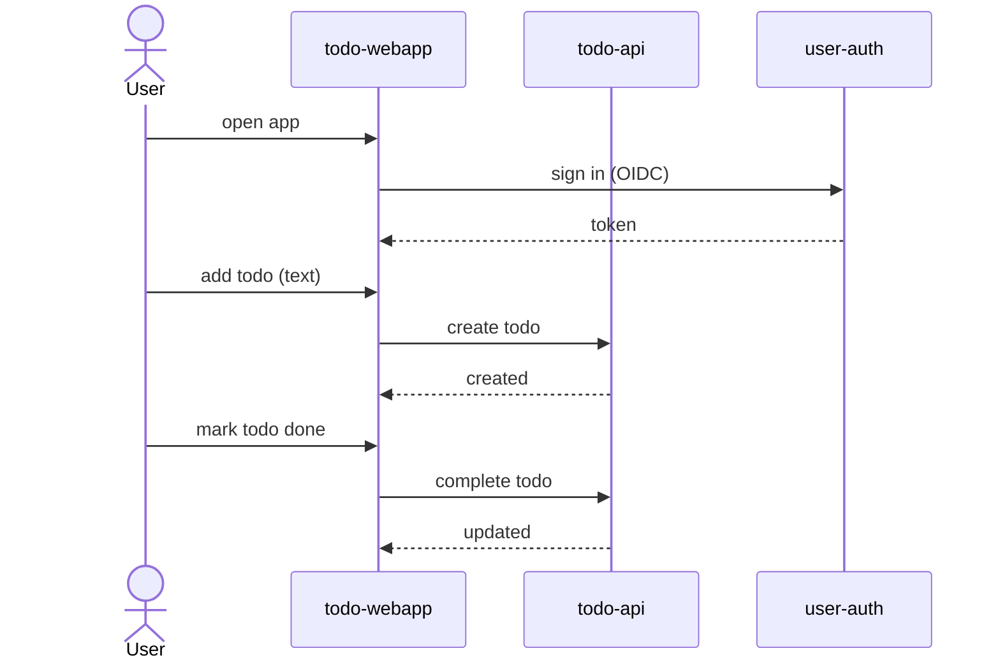

# Manage Todos

A signed-in User adds a todo item and later marks it done, with every call authenticated through Thunder.

```mermaid
sequenceDiagram
    actor User
    participant todo-webapp
    participant todo-api
    participant user-auth

    User->>todo-webapp: open app
    todo-webapp->>user-auth: sign in (OIDC)
    user-auth-->>todo-webapp: token
    User->>todo-webapp: add todo (text)
    todo-webapp->>todo-api: create todo
    todo-api-->>todo-webapp: created
    User->>todo-webapp: mark todo done
    todo-webapp->>todo-api: complete todo
    todo-api-->>todo-webapp: updated
```

